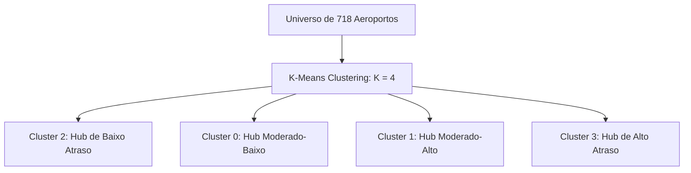

# 🛫 Projeto de Análise e Previsão de Atrasos de Voos

Este projeto visa analisar de forma abrangente o problema multibilionário dos atrasos e cancelamentos de voos nos EUA, focado no histórico massivo de operações do ano de 2015. O principal objetivo é utilizar todo o pipeline da **Ciência de Dados** para identificar gargalos operacionais (Análise Exploratória e Descritiva), prever atrasos futuros (Modelagem Preditiva) e extrair regras de negócios acionáveis para as companhias aéreas.

---

## 📋 Sumário do Projeto
*   **Limpeza e Estruturação de Dados (ETL):** Processamento de ~5.8 milhões de registros de voos de 2015, otimizando o uso de memória por meio de tipagem adequada de dados (categorias) e tratamento rigoroso de valores nulos.
*   **Análise Exploratória de Dados (EDA):** Análise univariada, bivariada e correlações físicas para desvendar fatores essenciais de atraso, avaliando companhias aéreas, sazonalidades e o comportamento temporal e espacial dos fluxos.
*   **Esteira Preditiva de Classificação (Atrasou? Sim/Não):** Modelagem binária comparativa com algoritmos como LightGBM, HistGradientBoosting, XGBoost e Regressão Logística. Tratamento de desbalanceamento de classes com Undersampling e SMOTE.
*   **Esteira Preditiva de Regressão (Duração do Atraso em Minutos):** Predição numérica da variável contínua de atraso, avaliada pelas métricas R², RMSE e WMAPE.
*   **Experimento V2 (Clima via API Open-Meteo):** Enriquecimento dos dados com variáveis climáticas locais consultadas via API externa de meteorologia histórica e compactadas por PCA.
*   **Análise Descritiva de Padrões Frequentes (FP-Growth):** Mineração de regras de associação para identificar interações não-lineares severas que provocam atrasos sistemáticos na malha.
*   **Segmentação de Aeroportos (K-Means Clustering):** Agrupamento não supervisionado de 718 aeródromos em 4 perfis operacionais de risco de pontualidade.

---

## 🗺️ Estrutura Detalhada do Pipeline (Notebook)

O notebook `flight-delays-and-cancellations_vf copy.ipynb` está organizado nas seguintes seções:
1. **Configurações Gerais**: Importações, silenciamento de avisos do ecossistema e definição de parâmetros globais.
2. **Carga e Otimização da Base de Dados**: Redução do uso de memória da base original (1.3 GB para 1.1 GB) utilizando dados categóricos.
3. **Análise de Valores Faltantes**: Tratamento e saneamento de registros com nulos.
4. **Análise Exploratória e Visualização de Dados (EDA)**:
    * Histograma de Atraso e Distribuição de Variáveis.
    * Análise de correlações físicas (correlação de 0.9379 entre atraso de partida e chegada).
    * Cruzamentos por Companhia Aérea, Aeroportos e Sazonalidade Temporal (Mensal, Semanal e Horária).
    * Efeito de Saturação Horária e Propagação de Atrasos (Efeito Cascata).
5. **Feature Engineering**: Criação de novas colunas como `DEP_HOUR` e ajustes temporais.
6. **Pré-processamento**: Configuração de targets (`IS_DELAYED`, `DELAY_DURATION`), divisão treino/teste e balanceamento com SMOTE.
7. **Esteiras de Modelagem**:
    * **Classificação**: Teste comparativo sob bases originais, balanceadas por Undersampling e SMOTE.
    * **Regressão**: Teste comparativo contínuo (V1 - Sem Clima).
    * **Integração com Clima V2**: Coleta de dados via API Open-Meteo, redução via PCA, join e retreino de classificação e regressão.
8. **Mineração de Regras de Associação**: FP-Growth para descoberta de regras operacionais.
9. **Segmentação Não Supervisionada**: K-Means Clustering para agrupamento de aeroportos (K=4).

---

## 📊 Insights Detalhados da Análise Exploratória (EDA)

A análise exploratória profunda do histórico de 2015 extraiu inteligência operacional crítica dividida em 5 frentes analíticas principais:

### 1. Modelagem Física e Mecânica de Recuperação em Voo (*In-Flight Recovery*)
*   **Relação Linear Espaço-Temporal:** O tempo de voo real (`ELAPSED_TIME`) e tempo no ar (`AIR_TIME`) correlacionam-se linearmente de forma quase perfeita com a distância geográfica (`DISTANCE`). Fricções operacionais no pátio e taxiamento (`TAXI_OUT`/`TAXI_IN`) aparecem como desvios verticais em relação à linha ideal de planejamento.
*   **Assimetria por Extensão de Rota:** Voos **curtos (< 400 milhas)** registram os piores índices de atraso na chegada. Por voarem em altitudes baixas de espaços aéreos metropolitanos congestionados, eles sofrem diretamente com problemas de solo.
*   **Mecanismo de Recuperação:** Voos **longos (> 1200 milhas)** possuem excelente pontualidade de pouso. Por passarem muito tempo em altitude de cruzeiro estável, os pilotos possuem margem operacional para aumentar a velocidade no ar ou solicitar vetores de aproximação mais diretos, neutralizando em voo os minutos perdidos em solo.

### 2. Ciclos Temporais e Padrões Semanais e Mensais
*   **Sazonalidade Mensal:** A malha aérea nacional apresenta dois grandes picos de estresse operacional: **Junho (média de 9,42 min de atraso)**, impulsionado por tempestades de verão e férias escolares; e o período de inverno (**Dezembro a Fevereiro**), devido a nevascas severas e feriados de fim de ano. 
*   **Janela de Otimização de Frota:** **Setembro (atraso médio negativo de -0,66 min)** destaca-se como o mês mais eficiente da operação aérea nacional, combinando clima estável com baixa demanda executiva. Essa calmaria o torna o período ideal para companhias aéreas programarem manutenções pesadas de frotas.
*   **Estresse Corporativo Semanal:** Quinta-feira e Sexta-feira lideram em atrasos acumulados (~6 minutos de média), devido ao cruzamento do fluxo corporativo de retorno semanal com as viagens de lazer. **Sábado (2,4 min)** é o dia mais fluído e pontual da malha nacional, aliviando de imediato a infraestrutura do controle de tráfego pela forte redução dos voos executivos.

### 3. Efeito Saturação Horária e Cascata de Atrasos
*   **Propagação em Bola de Neve:** Nas primeiras horas do dia (**04h às 07h**), a operação registra pontualidade excelente (médias fortemente negativas), pois as aeronaves estão prontas e posicionadas nos pátios.
*   **Acúmulo de Atrasos:** A partir das **08h**, inicia-se um acúmulo linear contínuo de atrasos hora a hora, atingindo o pico crítico entre **18h e 20h**. Esse padrão prova visualmente a propagação de atrasos acumulados (*late-aircraft delays*): atrasos residuais em pernas de voo matutinas acumulam-se progressivamente a cada trecho da escala diária da aeronave, colapsando a operação noturna nos aeroportos de chegada.

### 4. Desconexão Sazonal e o "Efeito Substituição"
*   **Atrasos de Junho vs. Cancelamentos de Fevereiro:** O pior mês em minutos de atraso (Junho) não reflete o pior mês em cancelamentos. O pico severo de cancelamentos de voos ocorre em **Fevereiro (4,9% de cancelados)**, gerado por nevascas que inviabilizam pistas e forçam o cancelamento preventivo por segurança.
*   **Gargalo de Verão:** Tempestades de verão em Junho são violentas mas rápidas, permitindo que as aeronaves continuem voando após janelas de espera. Isso evita cancelamentos severos, mas força o sistema nacional a acumular minutos de atraso em cascata.

### 5. Perfil de Eficiência Corporativa (Companhias Aéreas)
*   **Benchmarks de Eficiência:** A **Alaska Airlines** e a **Delta Air Lines** são consolidadas como referências mundiais de eficiência operacional, sustentando taxas mínimas de atraso e tempos médios de chegada negativos (pousos adiantados).
*   **Gargalos das Low-Cost:** Operadoras de baixo custo ultra-radical como **Spirit** e **Frontier** sacrificam a pontualidade para otimizar o tempo diário de uso de suas aeronaves, fazendo com que quase **30%** de seus voos pousem com atrasos graves.
*   **Estratégia de Cancelamento Preventivo:** A **Envoy Air** utiliza uma abordagem atípica: apresenta atrasos médios moderados, mas lidera de forma isolada com **5,0% de cancelamentos**. A empresa aborta voos problemáticos de forma precoce para quebrar a transmissão de atrasos em cadeia por sua malha aérea interna.

---

## 🤖 Modelagem e Resultados de Machine Learning

### 1. Frente de Classificação (Previsão de Ocorrência de Atraso)
O objetivo desta frente é estimar de forma binária se o voo vai pousar com atraso (atraso superior a 15 minutos).

> [!TIP]
> O balanceamento via **SMOTE** foi fundamental para aumentar a robustez de generalização de todas as arquiteturas baseadas em árvores frente ao desbalanceamento original dos dados de voos.

#### Tabela de Liderança Oficial (Classificação - Validação Cruzada F1-Score com SMOTE)

| Posição | Modelo Candidato | F1-Score (CV) | Status Operacional |
| :---: | :--- | :---: | :--- |
| **1º** | **LightGBM (LGBM)** | **0.963474** | **Homologado para Produção** |
| 2º | HistGradientBoosting (HGB) | 0.955632 | Desafiante (*Runner-up*) |
| 3º | XGBoost (XGB) | 0.934611 | Descartado (Muitos Falsos Alertas) |
| 4º | Regressão Logística (LR) | 0.915241 | Descartado (Limite Linear) |

*   **Veredito de Produção (LightGBM V1):** O LightGBM V1 foi homologado para produção. Ele apresentou um F1-Score de **0.84** no conjunto de testes reais não balanceados, sustentado por uma **Precisão de 0.86** e um **Recall de 0.83**. Isso garante que o modelo capture 83% das disrupções da malha aérea nacional com 86% de acerto nas notificações.
*   **Descarte do XGBoost:** Desclassificado devido à hiper-penalização parametrizada. Apresentou alto Recall (0.92), mas sua Precisão desabou para **0.63**, gerando um volume excessivo e caro de alarmes falsos de atraso.

---

### 2. Frente de Regressão Contínua (Previsão da Duração do Atraso em Minutos)
Esta esteira prevê a variável contínua `DELAY_DURATION` (minutos de atraso efetivos observados na chegada ao portão).

#### Tabela de Liderança Oficial (Regressão V1 - Sem Clima)

| Posição | Modelo Candidato | R² (CV) | R² (Teste) | RMSE (Teste) | WMAPE (Teste) | Status Operacional |
| :---: | :--- | :---: | :---: | :---: | :---: | :--- |
| **1º** | **LightGBM (LGBM)** | **0.9248** | **0.9287** | **10.71 min** | **35.05%** | **Homologado para Produção** |
| 2º | Regressão Linear (LR) | 0.9205 | 0.9285 | 10.72 min | 36.97% | Alternativa de Baixo Custo |
| 3º | XGBoost Regressor (XGB) | 0.9187 | 0.9123 | 11.88 min | 35.66% | Descartado (Leve Overfitting) |
| 4º | HistGradientBoosting (HGB) | 0.9109 | 0.9002 | 12.67 min | 35.97% | Descartado (Suavização Excessiva) |

> [!NOTE]
> *   **O Fenômeno da Regressão Linear:** A Regressão Linear clássica (OLS) obteve uma performance equivalente ao LightGBM (R² = 0.9285). Isso ocorre porque a correlação física entre o atraso na partida (`DEPARTURE_DELAY`) e o atraso na chegada (`ARRIVAL_DELAY`) é extremamente linear e explica sozinha 88% da variância total da chegada.
> *   **A Instabilidade Matemática do MAPE:** O MAPE tradicional explodiu para a casa dos quatrilhões por cento (~10^17%) devido a voos que pousam pontualmente (atraso = 0 minuto ou valores negativos), o que força divisões por zero ou por frações espúrias. O **WMAPE (Weighted MAPE)** corrigiu essa anomalia e estabilizou as métricas ao redor de **35%**.

---

### 3. Experimento V2: Enriquecimento Climático (API Open-Meteo)
Avaliou-se a inclusão de 5 componentes do PCA climático extraídos de uma base histórica meteorológica local para o retreino dos regressores:

*   **Resultados Regressão V2 (+ Clima):**
    *   **LightGBM V2:** `R²: 0.9260` | `RMSE: 10.92 min` | `WMAPE: 35.03%`
    *   **XGBoost V2:** `R²: 0.9230` | `RMSE: 11.13 min` | `WMAPE: 35.56%`
    *   **HGB V2:** `R²: 0.9191` | `RMSE: 11.41 min` | `WMAPE: 35.76%`
    *   **Regressão Linear V2:** `R²: 0.9198` | `RMSE: 11.36 min` | `WMAPE: 37.28%`

> [!WARNING]
> **Decisão de Arquitetura - Descarte do Experimento Climático (V2):** 
> Devido ao descasamento de fusos horários (horários locais dos voos vs. UTC da API), 99.9% dos registros de clima resultaram em valores nulos (NaN), exigindo imputação por mediana. Modelos lineares sofreram distorção na reta OLS devido ao excesso de dados imputados (RMSE subiu de 10.72 para 11.36 min).
>
> Como a complexidade de rede, API externa e infraestrutura de dados da versão V2 não superou o teto estatístico obtido pela base limpa pré-decolagem (LightGBM V1 com **RMSE de 10.71 min**), o **LightGBM V1 foi consagrado como a versão de produção oficial**.

---

## 📈 Regras de Associação de Negócio (FP-Growth)

O algoritmo **FP-Growth** isolou interações operacionais recorrentes, gerando regras com alta significância operacional:

*   **Voos Curtos da Tarde Amplificam Atrasos:** A regra contendo o antecedente **`Curto (<500mi) + Tarde (12-16h)`** associada ao consequente **`Atrasado (16-60min)`** atinge uma **Confiança de 53,68%** e **Lift de 1.1290**.
    *   *Insight:* Voos regionais curtos passam pouco tempo em cruzeiro, impedindo que os pilotos acelerem a aeronave no ar para recuperar atrasos gerados em solo.
*   **Efeito Bola de Neve no Fim do Dia:** O antecedente **`Fim de tarde (17-20h)`** associado a **`Muito atrasado (>60min) + Médio (500-1500mi)`** opera com **Confiança de 35,97%** e **Lift de 1.1448**.
    *   *Insight:* Atrasos residuais acumulados ao longo das pernas do dia geram efeito cascata crítico (*late-aircraft delays*) nas janelas de portão nos grandes hubs durante a noite.

---

## 📊 Clusterização de Aeroportos (K-Means)

A análise não supervisionada segmentou 718 aeródromos dos EUA em **K = 4** clusters bem delineados, permitindo definir diretrizes estratégicas específicas de controle de fluxo de pátio:



*   **🟢 Cluster 2: Hub de Baixo Atraso (Benchmark de Eficiência)**
    *   *Volume:* 279 aeroportos (ex: `PDX`, `SNA`, `PIT`, `SAT`).
    *   *Métricas:* Taxa de atraso de **10.3%** e Atraso Médio de **-1.6 min** (pousam adiantados).
    *   *Diretriz:* Zona de máxima eficiência e estabilidade operacional.
*   **🟢 Cluster 0: Hub Moderado-Baixo (Estabilidade Regional)**
    *   *Volume:* 121 aeroportos (ex: `HNL`, `SJU`, `OGG`).
    *   *Métricas:* Taxa de atraso estável de **11.5%** e Atraso Médio de **-1.3 min**.
    *   *Diretriz:* Padrão operacional adequado. Apenas monitorar conexão de turnaround em feriados.
*   **🟡 Cluster 1: Hub Moderado-Alto (A Cauda Longa do Tráfego Comercial)**
    *   *Volume:* 291 aeroportos (ex: `TPA`, `DAL`, `HOU`, `BNA`, `STL`).
    *   *Métricas:* Taxa de atraso de **18.0%** e Atraso Médio de **+6.9 min**.
    *   *Diretriz:* Prioridade de gestão de solo. Gargalos físicos frequentes exigem alertas preventivos automáticos nos portões de embarque.
*   **🔴 Cluster 3: Hub de Alto Atraso (Os Megahubs Sob Saturação Estressante)**
    *   *Volume:* 27 aeroportos ultra-críticos (ex: `ATL`, `ORD`, `DFW`, `DEN`, `LAX`).
    *   *Métricas:* Quase **20% (19.8%)** de operações com atraso crítico e Atraso Médio de **+5.6 min**.
    *   *Diretriz:* Corações logísticos saturados da malha. Exige posicionamento preventivo de tripulações e aviões reserva (*hot spares*) e cancelamento de conexões sensíveis de forma antecipada para evitar efeito dominó nacional.

---

## 🛠️ Tecnologias e Bibliotecas Utilizadas
*   `python >= 3.9`
*   `pandas` & `numpy` (Manipulação e Engenharia de Dados)
*   `scikit-learn` (Algoritmos de ML, Regressão Linear, Validação Cruzada)
*   `lightgbm` & `xgboost` (Estruturas de Boosting de Gradiente)
*   `imbalanced-learn` (Técnicas de Balanceamento de Classes via SMOTE)
*   `mlxtend` (Mineração de Regras de Associação via FP-Growth)
*   `matplotlib` & `seaborn` (Visualização Avançada e Gráficos de Radar)

---

## 🚀 Como Executar

1. Clone o repositório no seu diretório local.
2. Crie ou ative seu ambiente virtual Python e instale as dependências:
   ```bash
   pip install -r requirements.txt
   ```
3. Garanta que a base de dados histórica original de 2015 esteja posicionada na raiz do projeto (cuidado com o volume de ~1.1GB total).
4. Abra e execute sequencialmente as células do arquivo:
   `flight-delays-and-cancellations_vf copy.ipynb`

---

## 🌐 Demonstração Online
Visualize o projeto completo e os resultados diretamente no seu navegador:
<<<<<<< Updated upstream
👉 [Acesse a versão HTML do Notebook](https://carloseadi.github.io/Projeto_Flight_Cancellation/flight-delays-and-cancellations_vf.html)

---
*Este estudo foi desenvolvido para demonstrar a aplicação ponta a ponta de engenharia de dados, business intelligence avançado e Machine Learning, atuando diretamente em um gargalo operacional mundial.*
=======
👉 [Acesse a versão HTML do Notebook](https://carloseadi.github.io/Projeto_Flight_Cancellation/)

---
*Este estudo consolida uma infraestrutura completa de Ciência de Dados ponta a ponta para otimização, predição contínua e mineração descritiva de processos aplicados à malha aérea comercial.*
